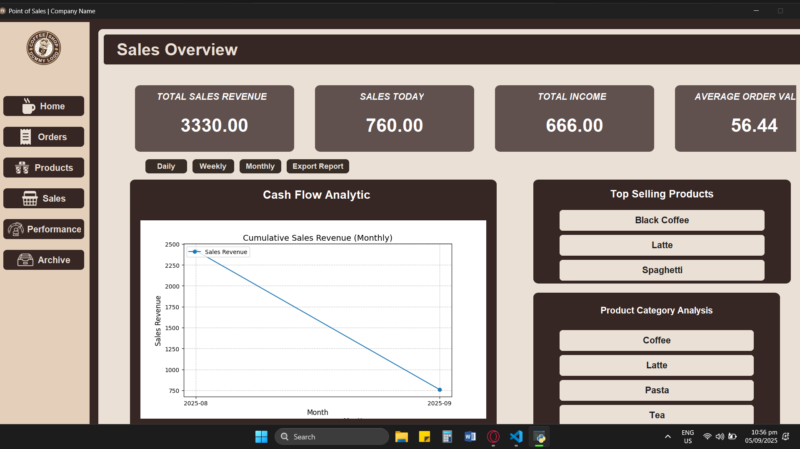

# PYTHON POS WITH DATA ANALYTICS

## Overview
This is a full-featured Point of Sale (POS) system built with Python, CustomTkinter, and MySQL, designed for retail and food businesses. It integrates sales, inventory, product management, receipt handling, and advanced data analytics, including machine learning for product suggestions.

## Main Features

- **Sales Management**: Process orders, handle payments, generate receipts, and track daily/monthly sales. Includes export to Excel and analytics dashboards.
- **Inventory Management**: Add, edit, and delete ingredients and products. Track inventory by category and status, with real-time updates and status dropdowns.
- **Product Management**: Configure products, categories, prices, and images. Supports adding new products manually or via machine learning suggestions.
- **Order Processing**: Create, view, and update orders. Includes order status tracking (Pending, In Progress, Completed), subtotal calculations, and archiving.
- **Receipt Handling**: Generate and print receipts, manage payment methods (cash, e-wallet), and associate sales with cashier accounts.
- **Data Analytics**: Visualize sales data with pie charts, line graphs (daily, weekly, monthly), and employee sales performance. Analyze top sellers and revenue trends.
- **User Management**: Login system for admin and employees, with role-based access to features.

## System Structure

- `main.py`: Entry point, launches the main window and login form.
- `components/`: Contains all UI containers and actions:
  - `containers/`: Home, inventory, orders, products, sales, receipts, side panel, forms, user profile, etc.
  - `actions/`: Database actions, inventory management, data analytics, machine learning modules.
  - `actions/db/`: Database queries for products, sales, categories, employees, etc.
  - `actions/data_analytics/`: Data visualization and export functions.
- `db_setup/`: Database connection setup.
- `POS_DATABASE_FILES/`: SQL files for database schema and tables.
- `imgs/`: Icons and images for UI.

## Database

- Uses MySQL with the database name `pos_new`.
- Import all SQL files in `POS_DATABASE_FILES/` to set up tables for products, sales, users, categories, etc.

### Entity Relationship Diagram


## Requirements

Install the following Python packages:

```
pip install customtkinter
pip install tkinter
pip install pillow
pip install scikit-learn
pip install scikit-surprise
pip install pandas
pip install numpy
```

## How to Run

1. Import all SQL files in `POS_DATABASE_FILES/` into your MySQL server (database name: `pos_new`).
2. Install all required Python packages (see above).
3. Run `main.py` to start the application.
4. Default admin login:
   - Username: `admin`
   - Password: `12345678`


## Screenshots

Below are some screenshots of the system to showcase its main features and user interface:

### Login Page


### Home Page


### Sales Analytics




### Performance Dashboard


### Product Analysis


### Purchase Order


## Support

If you encounter any issues, please create an Issue in the repository.
